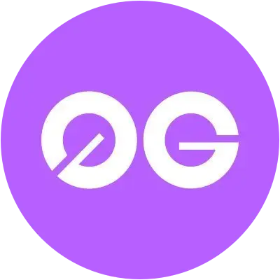

<p align="center">
  
</p>

<h1 align="center">⚡ Zerix</h1>

<p align="center">
  <strong>AI-Powered Real-Time 0G Network Explorer & Visualizer</strong>
</p>

<p align="center">
  <a href="https://0g.ai">
    
  </a>
  <a href="https://nextjs.org">
    
  </a>
  <a href="https://www.typescriptlang.org">
    
  </a>
  <a href="https://groq.com">
    
  </a>
  <a href="LICENSE">
    
  </a>
</p>

<p align="center">
  <a href="#-features">Features</a> •
  <a href="#-ai-integration">AI Integration</a> •
  <a href="#-quick-start">Quick Start</a> •
  <a href="#-architecture">Architecture</a> •
  <a href="#-contributing">Contributing</a>
</p>

---

## 🌟 Overview

**Zerix** is a sophisticated, AI-powered real-time blockchain explorer and network visualizer for the **0G Network** - the first AI-native blockchain designed for decentralized AI applications. Built with modern web technologies, Zerix provides an immersive experience for monitoring network activity through an interactive 3D globe, live transaction streams, AI-powered insights, and comprehensive analytics.

> **All data is 100% real** - fetched directly from 0G RPC, DefiLlama APIs, and analyzed by Llama 3.1 AI. No mock data.

---

## 🔗 0G Network Info

| Parameter | Value |
|-----------|-------|
| **Network Name** | 0G Mainnet |
| **Chain ID** | 16661 |
| **Token Symbol** | 0G |
| **RPC URL** | https://evmrpc.0g.ai |
| **Block Explorer** | https://chainscan.0g.ai |
| **Storage Indexer** | https://indexer-storage-turbo.0g.ai |

### Contract Addresses (0G Storage)

| Contract | Address |
|----------|---------|
| Flow | `0x62D4144dB0F0a6fBBaeb6296c785C71B3D57C526` |
| Mine | `0xCd01c5Cd953971CE4C2c9bFb95610236a7F414fe` |
| Reward | `0x457aC76B58ffcDc118AABD6DbC63ff9072880870` |

---

## ✨ Features

### 🤖 AI-Powered Network Intelligence

**Real-time AI Analysis** powered by **Llama 3.1** (via Groq):

- 📊 Network condition analysis
- 💡 Actionable transaction timing insights
- ⚡ Gas price optimization suggestions
- 🔮 Congestion level predictions
- 🛡️ Smart rate limiting & caching

### 🌍 Interactive 3D Globe

- Real-time transaction visualization with animated arcs
- Dynamic node indicators showing network activity
- Smooth camera controls and auto-rotation
- Responsive WebGL rendering with Three.js

### 📊 Live Dashboard Components

| Component | Description |
|-----------|-------------|
| **Block History Chart** | Last 45 blocks with transaction counts |
| **TPS Monitor** | Real-time transactions per second |
| **Gas Tracker** | Live gas price in Gwei |
| **Recent Transactions** | Latest 10 transactions with details |
| **TVL Panel** | Total Value Locked (via DefiLlama) |
| **Network Stats** | Block time, chain info, gas token |

### 🎨 Modern UI/UX

- Glassmorphism design with 0G branding
- Framer Motion animations
- Responsive grid layout
- Dark mode optimized
- Custom scrollbars and transitions

---

## 🚀 Quick Start

### Prerequisites

- Node.js 18+ 
- npm or yarn
- Groq API Key (optional, for AI features)

### Installation

```bash
# Clone the repository
git clone https://github.com/yourusername/zerix.git
cd zerix

# Install dependencies
npm install

# Set up environment variables
cp .env.example .env.local
# Add your GROQ_API_KEY to .env.local

# Run development server
npm run dev
```

Open [http://localhost:3000](http://localhost:3000) to view Zerix.

### Environment Variables

```env
# Required for AI insights (optional - falls back to rule-based)
GROQ_API_KEY=your_groq_api_key_here
```

---

## 🏗️ Architecture

```
zerix/
├── app/
│   ├── page.tsx              # Main dashboard
│   ├── layout.tsx            # Root layout with metadata
│   ├── globals.css           # Global styles
│   ├── api/
│   │   └── ai-insight/       # AI analysis endpoint
│   └── components/
│       ├── Globe.tsx         # 3D visualization
│       ├── Header.tsx        # Navigation
│       ├── BlockHistoryChart.tsx
│       ├── LiveChart.tsx     # TPS & Gas charts
│       ├── RecentTransactions.tsx
│       ├── TVLPanel.tsx
│       ├── NetworkInsights.tsx  # AI insights
│       └── ...
├── hooks/
│   ├── useZeroG.ts           # 0G network data hooks
│   ├── useZeroGWebSocket.ts  # Real-time connection
│   └── useDefiLlama.ts       # TVL data hooks
├── lib/
│   ├── zerog.ts              # 0G client & utilities
│   └── defillama.ts          # DefiLlama API
└── public/
    └── zerog-logo.png        # Logo assets
```

### Data Flow

```
0G RPC (evmrpc.0g.ai)
        │
        ▼
   lib/zerog.ts (viem client)
        │
        ▼
   hooks/useZeroG.ts (React hooks)
        │
        ▼
   Components (UI rendering)
```

---

## 🛠️ Tech Stack

| Category | Technology |
|----------|------------|
| Framework | Next.js 16 (App Router) |
| Language | TypeScript 5.0 |
| Styling | Tailwind CSS |
| Animation | Framer Motion |
| 3D Graphics | Three.js + React Three Fiber |
| Blockchain | viem (EVM client) |
| AI | Groq (Llama 3.1) |
| Data | DefiLlama API |

---

## 📄 License

MIT License - see [LICENSE](LICENSE) for details.

---

<p align="center">
  Built with ⚡ for the 0G Network
</p>
